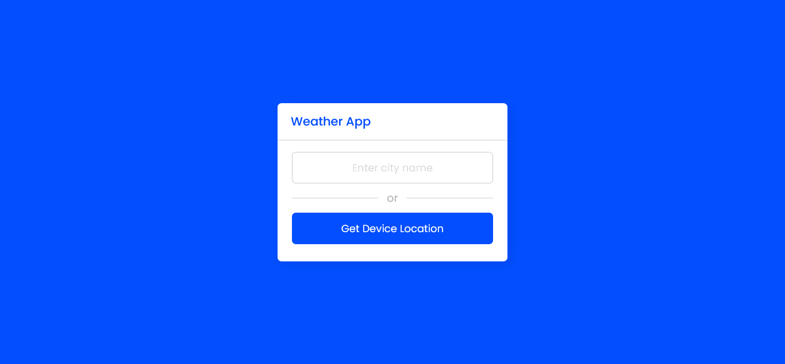
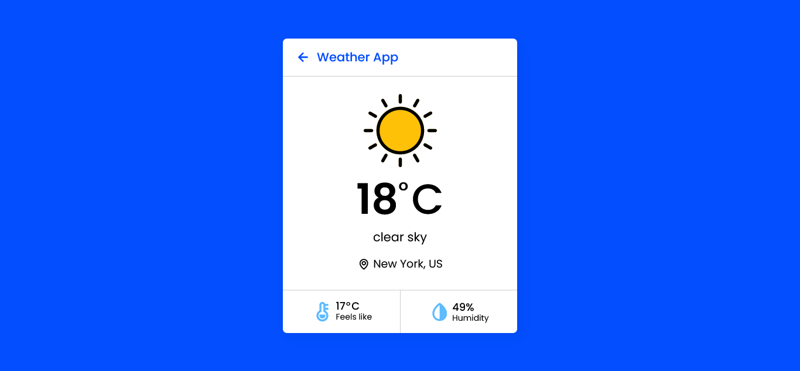
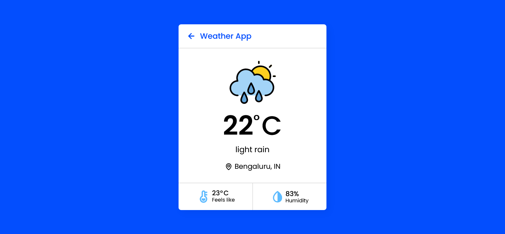
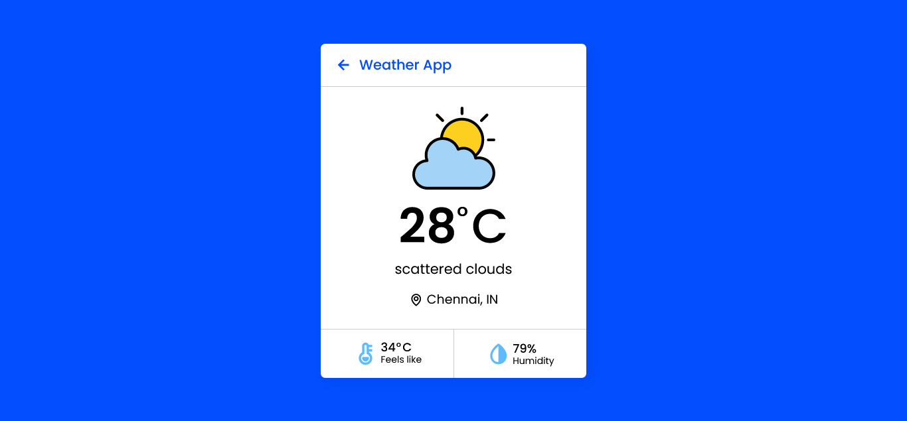

# Weather App


Weather app is used to fetch the weather status for the given city name or for your current location using latitude & longitude measures created using HTML5, CSS3, JavaScript and Open Weather API.

## Installation

**STEP 1 :** Clone the repository using `git`
```bash
git clone https://github.com/Prakashdeveloper03/Weather-App-JS.git
```

**STEP 2 :** Visit the [openweathermap.org](https://openweathermap.org/) website and get your free API key.

**STEP 3 :** Change to the `js` folder
```
cd Weather-App-JS-main/assets/js
```

**STEP 4 :** Create a new javascript file named `config.js` in `js` folder and insert the below lines
```js
let config = {
  API_KEY: "YOUR_API_KEY"
};
```

**STEP 5 :** Replace the "YOUR_API_KEY" with your actual API key

## 📷 Screenshots
### App Interface


### Clear Sky


### Rain


### Haze


### Scattered Clouds
